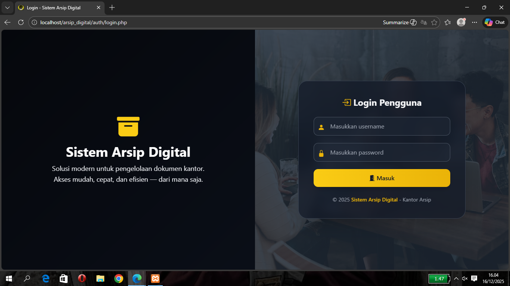
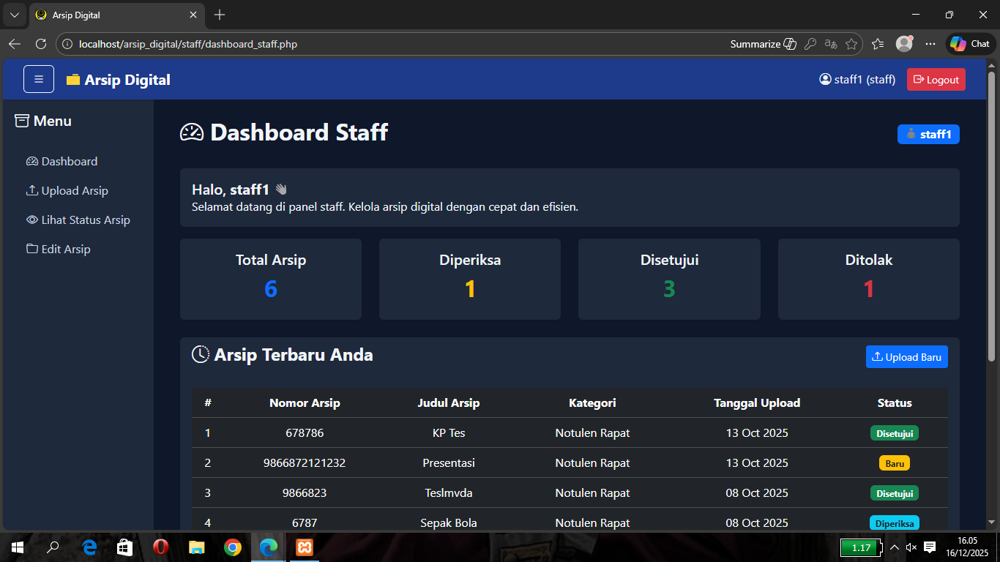
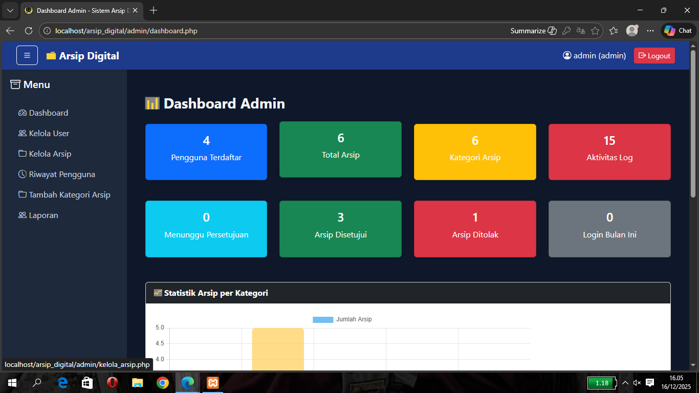

# 📁 Sistem Arsip Digital Berbasis Web

## 📌 Deskripsi Proyek

Sistem Arsip Digital Berbasis Web adalah aplikasi berbasis website yang digunakan untuk mengelola arsip dokumen secara digital. Sistem ini dirancang untuk membantu proses penyimpanan, pencarian, pengelolaan, serta pengawasan arsip agar lebih **efektif, efisien, aman, dan terstruktur** dibandingkan metode pengarsipan manual.

Aplikasi ini sangat cocok digunakan pada instansi pendidikan, organisasi, maupun perkantoran yang membutuhkan sistem pengelolaan arsip terkomputerisasi dengan pembagian hak akses yang jelas.




---

## 🎯 Tujuan Pengembangan

* Mengurangi penggunaan arsip fisik (kertas)
* Mempermudah proses pencarian dan pengelolaan dokumen
* Meningkatkan keamanan dan keutuhan data arsip
* Menyediakan transparansi aktivitas upload dan perubahan arsip
* Mendukung pengelolaan arsip yang rapi dan terorganisir

---

## 👥 Role & Hak Akses Pengguna

Sistem ini memiliki **3 role utama** dengan hak akses yang berbeda:

### 🔹 Staff



* Upload arsip dokumen
* Mengedit arsip yang telah diunggah
* Setiap aktivitas **upload dan edit tercatat otomatis** dalam riwayat
* Tidak dapat menghapus arsip

### 🔹 Admin



* Login sebagai pengelola sistem
* CRUD data arsip (Create, Read, Update, Delete)
* Manajemen pengguna dan role
* Melihat seluruh data arsip dan aktivitas sistem

### 🔹 Pimpinan (Owner)


* Akses **read-only** terhadap arsip
* Menyetujui (approve) arsip yang diunggah staff
* Melihat **riwayat upload dan edit arsip** sebagai bentuk transparansi
* Digunakan untuk monitoring dan pengambilan keputusan

---

## ⚙️ Fitur Utama

* 🔐 Autentikasi pengguna (Login & Hak Akses)
* 📂 Manajemen arsip digital berbasis role
* ⬆️ Upload dan penyimpanan file arsip
* ✏️ Pencatatan otomatis riwayat upload & edit
* 🔍 Pencarian arsip berdasarkan kategori atau kata kunci
* 🗂️ Pengelompokan arsip berdasarkan jenis
* ✅ Persetujuan arsip oleh pimpinan
* 👥 Manajemen pengguna (Admin)

---

## 🧑‍💻 Teknologi yang Digunakan

* **Bahasa Pemrograman**: PHP
* **Database**: MySQL
* **Web Server**: Apache (XAMPP)
* **Frontend**: HTML, CSS, JavaScript
* **Version Control**: Git & GitHub

---

## 🗃️ Struktur Folder (Gambaran Umum)

```
arsip_digital/
├── admin/        # Halaman dan fitur admin
├── auth/         # Autentikasi dan login
├── backup/       # Backup database / arsip
├── config/       # Konfigurasi database dan sistem
├── img/          # Asset gambar & screenshot aplikasi
├── include/      # File include (header, footer, dll)
├── pimpinan/     # Dashboard pimpinan (read & approval)
├── staff/        # Dashboard staff (upload & edit arsip)
├── upload/       # Penyimpanan file arsip
├── vendor/       # Dependency (Composer)
├── index.php
├── composer.json
└── composer.lock
```
---

## 🚀 Cara Menjalankan Aplikasi

1. Clone repository ini:

   ```bash
   git clone git@github.com:mohammadfijar/arsip-digital-web.git
   ```
2. Pindahkan folder ke direktori `htdocs` (XAMPP)
3. Jalankan **Apache** dan **MySQL** melalui XAMPP Control Panel
4. Import database ke **phpMyAdmin** (jika tersedia)
5. Akses aplikasi melalui browser:

   ```
   http://localhost/arsip_digital
   ```

---

## 📄 Lisensi

Proyek ini dibuat untuk keperluan **pembelajaran dan pengembangan akademik**. Silakan digunakan dan dikembangkan kembali dengan mencantumkan sumber.

---

✨ *Sistem Arsip Digital Berbasis Web ini diharapkan mampu menjadi solusi pengelolaan arsip yang modern, transparan, aman, dan efisien.*
